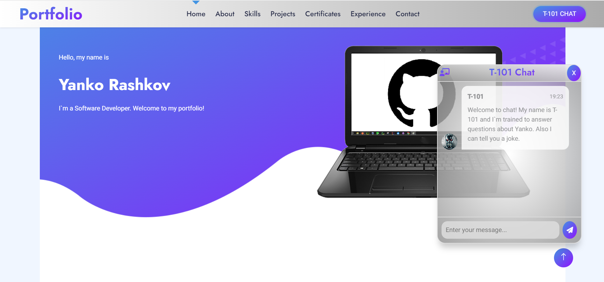

# About-Me-Flask

 Portfolio web site: Flask Project

### [Upgrade design in progress.]

Check it:
https://yr-portoflio.onrender.com/

### This is simple web app with Flask. Have small Chatbot built from scratch.
___________________________________________________________________________

Technologies:

[  ] BackEnd
- Python
- Flask
- Tensorflow, Keras, Numpy, NLTK, Pickle
- Unit Testing

[  ] FrontEnd
 - HTML & CSS, Bootstrap, SCSS
 - Jinja2
 - JavaScript/jQuery

[  ] DevOps 
 - CI/CD workflow: GitHub Actions
 - Container build: Docker
 - Cloud services: Render.com (Azure - optional)
___________________________________________________________________________

